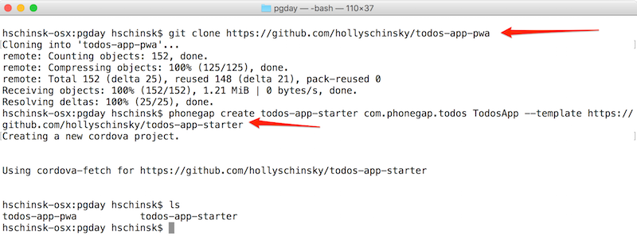
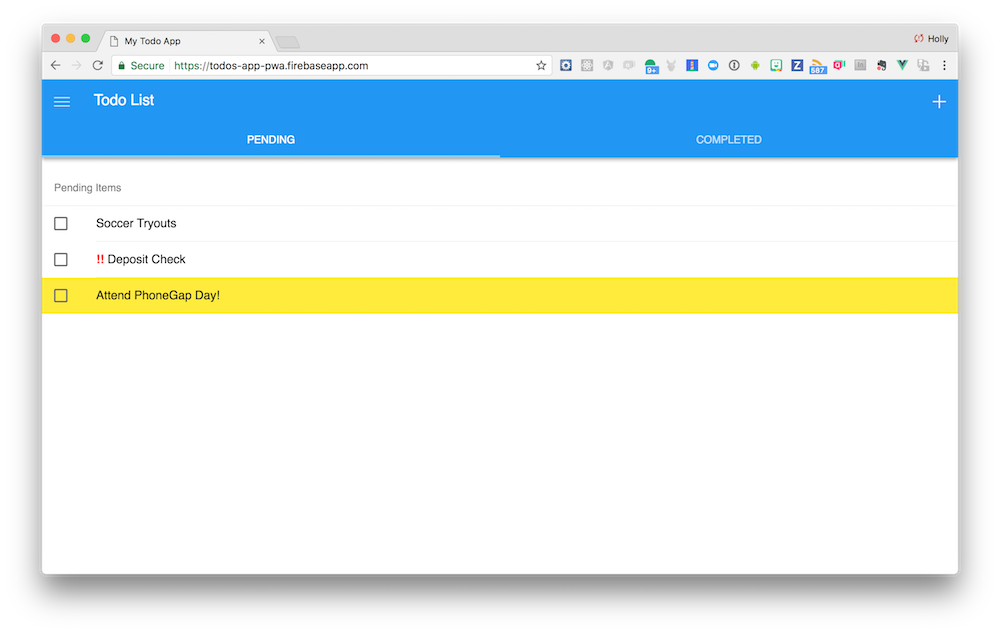

## Overview
This lesson assumes you have the PhoneGap CLI installed. If you have not installed it yet, you can do so now with the following command:

    npm install -g phonegap

>Alternatively, you can use the Cordova CLI or the PhoneGap Desktop application to create your new project but this workshop assumes the PhoneGap CLI.

## Project Creation
In this lesson we will create a starter project and get a copy of the final project for reference. 

1. Create a new folder on your desktop called **pgday** and navigate into it

        mkdir pgday
        cd pgday/

2. Now create a new app project based on the starter template. From the command line (and within the **pgday** folder), use the PhoneGap CLI with the following command which specfies an existing GitHub repo as the template.

   ```
   phonegap create todos-app-starter com.phonegap.todos TodosApp --template https://github.com/hollyschinsky/todos-app-starter
   ```

   or with Cordova...

   ```
   cordova create todos-app-starter --id com.phonegap.todos --name TodosApp --template https://github.com/hollyschinsky/todos-app-starter
   ```

   In this command, _todos-app-starter_ is the **path**, _com.phonegap.todos_ is the **fully qualified package name** and _TodosApp_ is the **app name**. Modify these as you wish.

   >If you only have the Desktop app you can still use it to create a new project and just select the blank template. You will need to download or clone the [todos-app-starter](https://github.com/hollyschinsky/pwa-workshop-starter) app first and then replace the `www` folder and `config.xml` in your newly project with those from the **todos-app-starter** repo.


2. Next get a copy of [the final app project](https://github.com/hollyschinsky/todos-app-pwa) by either cloning it into to your root **pgday** folder with `git` or downloading the zip. You can use this project for reference throughout the workshop.

 

3. You should now have a **pgday** folder with the two projects below:

         ../pgday/todos-app-starter
         ../pgday/todos-app-pwa


### Test it out!

Before moving to lesson 2, test out the app. `cd` into the **todos-app-starter** and type `phonegap serve`, then use your Chrome browser to navigate to the URL returned.


 
Open the Chrome dev tools tools with the `Option+Command+I` combination or via the **View -> Developer** option from the menu and use the mobile emulator tools to see how the app looks on different devices. You will need to reload the page if switching between an android or ios device to pick up the other style sheet.


 >*The Vue developer tools Chrome extension shown in the above is useful for debugging your apps built with this app stack in the future, and require the non-minified version of vue. This is not required for this workshop. 


### PhoneGap CLI Alternatives
If you're using the Cordova CLI you will need to add the `browser` platform first (`cordova platform add browser`), then run `cordova serve` and open `http://localhost:8000/browser/` in the browser. If you are using PhoneGap Desktop, hit the green _play_ icon to start the server and then navigate to the URL shown in the bottom status bar.


<div class="row" style="margin-top:40px;">
<div class="col-sm-12">
<a href="index.html" class="btn btn-default"><i class="glyphicon glyphicon-chevron-left"></i> Previous</a>
<a href="lesson2.html" class="btn btn-default pull-right">Next <i class="glyphicon
glyphicon-chevron-right"></i></a>
</div>
</div>
