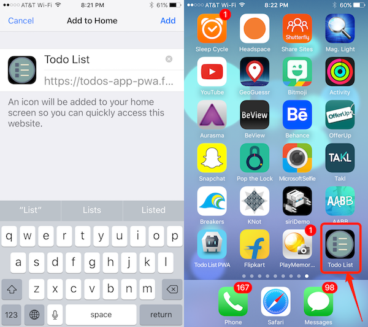

## Overview
Many developers assume that Apple doesn't support Progressive Web Apps. This really isn't the case in the full sense of what Progressive Web Apps are. It's true they do not currently support service workers, but PWA's are made up of a collection of features (add to homescreen, securely hosted etc), which are supported on iOS, just in a different way. You should always think about what kind of progressive enhancements you can make to your base apps to support the latest features on different platforms to enhance the user experience. In this lesson we'll learn about some HTML tags we can add to our apps to provide progressive enhancements for iOS and Windows.

## Exercise 
Open the **index.html** file and go through the following sections:

### iOS Web App Customizations
- Add the `apple-mobile-web-app-capable` meta tag to your app to run in **standalone** (fullscreen) mode when launched from the home screen:

    `<meta name="apple-mobile-web-app-capable" content="yes">`

  >This setting removes all of the browser chrome around your app, including the URL text field and bottom button bar. Only the status bar will be displayed. Check out [this article](https://medium.com/@firt/dont-use-ios-web-app-meta-tag-irresponsibly-in-your-progressive-web-apps-85d70f4438cb) for specific UX considerations.

- Set the status bar color to use when the app is launched from the home screen:

    `<meta name="apple-mobile-web-app-status-bar-style" content="black">`

   >There are three options to choose from: `default`, `black`, and `black-translucent`. The most compatibility is black; default and black-translucent behave differently between iOS 6 and 7. (Sometimes on iOS 7+, the status bar starts as white-on-white or black-on-black and requires a restart of the app to fix it).

- Set the title to display for your app when it's added to the home screen:

    `<meta name="apple-mobile-web-app-title" content="Todo List">`

   >If you don't specify this tag, iOS will use the `<title>` tag. If that is missing too, it will default to “Favorites”. Also note that the title is limited to 8 to 12 characters.    

- Set the icon to use when the app is added to the home screen:

    `<link rel="apple-touch-icon" href="img/icons/apple-touch-icon.png">`

- Set the startup image to launch when your app is launched from the home screen with the following tag:

    `<link href="img/launch.png" rel="apple-touch-startup-image">`

  >By default, the icon is a screenshot of the page. If there are no icon tags, Safari will try various URLs depending on the device. You should check out the [Apple docs](https://developer.apple.com/library/content/documentation/AppleApplications/Reference/SafariWebContent/ConfiguringWebApplications/ConfiguringWebApplications.html) specifically  for for how to set different sizes and resolutions for your icons and launch images. 

#### Example 
  The screenshot below shows how these settings affects the app when you choose to add it to your homescreen on iOS:

   

### Microsoft Windows Web App Customizations

- Set the tile image to use when the app is pinned to the home screen:

        <meta name="msapplication-TileImage" content="img/icons/mstile-150x150.png">

- Set a color for the tile to use when the app is pinned to the home screen:

        <meta name="msapplication-TileColor" content="#2F3BA2">

> See the [Microsoft Pinned site metadata reference](https://msdn.microsoft.com/en-us/library/dn255024(v=vs.85).aspx) for more details.

### Resources
- [Don’t use iOS meta tags irresponsibly in your Progressive Web Apps](https://medium.com/@firt/dont-use-ios-web-app-meta-tag-irresponsibly-in-your-progressive-web-apps-85d70f4438cb)
- [iOS Configuring Web Apps Guide](https://developer.apple.com/library/content/documentation/AppleApplications/Reference/SafariWebContent/ConfiguringWebApplications/ConfiguringWebApplications.html).
- [Microsoft Pinned Site Enhancements](https://msdn.microsoft.com/en-us/library/bg183312(v=vs.85).aspx#)

<a href="lesson2.html" class="btn btn-default"><i class="glyphicon glyphicon-chevron-left"></i> Previous</a>
<a href="lesson4.html" class="btn btn-default pull-right">Next <i class="glyphicon
glyphicon-chevron-right"></i></a>

