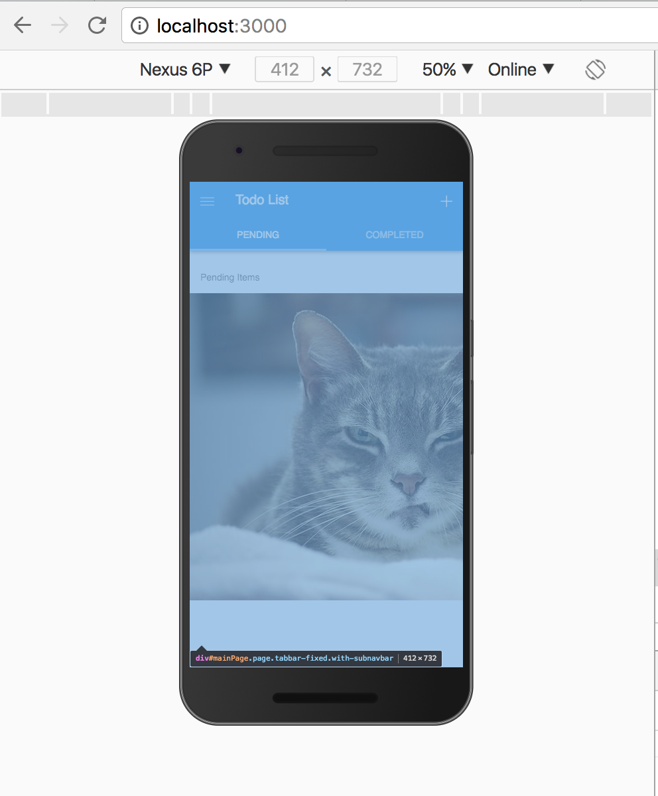

## Overview
A useful feature of service workers is the concept of _Network Interception_. It can be used to intercept a fetch request and change the response returned. In this exercise we'll see how it works by coding a simple service worker that intercepts an image request and returns a different fetched response.

## Exercises

1. Create a new file called **service-worker.js** in your **www** folder.
2. Paste in the following code:

        self.addEventListener('install', function(e) {
            console.log('[ServiceWorker] Install');
        });

        self.addEventListener('activate', function(event) {
            console.log('[ServiceWorker] Activate');
        });

        self.addEventListener('fetch', function(event) {
            console.log('Network intercept example. Testing this URL for a png: ', event.request.url);
            if (/\.png$/.test(event.request.url)) {
                event.respondWith(
                    fetch('https://static.boredpanda.com/blog/wp-content/uploads/2017/01/angry-cat-photography-02-5874a28aee900__700.jpg',
                    { mode: 'no-cors'}).then(function(response) {
                        console.log("Response from network intercept " + response);
                        return response;
                })
            )}
            else return fetch(event.request);                           
         });

   >This code simply creates handlers for the `install` and `activate` events with logging statements, but then in the `fetch` event intercepts a call to load a **.png** file and instead returns a silly cat pic.

3. Next you need to register this new service worker so the app is aware of it and can download it. The code checks to make sure the browser supports `serviceWorker` and then calls the `register` method with the name of the new service worker file. Open your **index.html** file and add the following into the `<head></head>` of the page:

        

   >This is considered a _progressive enhancement_, where it will only enhance the app with the service worker features where supported but run just fine elsewhere.

2. Now we need to make sure our app has a **.png** to load. I left one commented out in the starter app for quick testing. While in **index.html** file, scroll down to the **Pending todos** template code and uncomment the following (it's marked with a comment _KEEP FOR NETWORK INTERCEPT LESSON_):

      ``      

4. Now run the application again using `phonegap serve` but be sure to first read the following before navigating to it:

   >Since service workers are required to be run on a secure site (`https://`), OR during dev't with `localhost`, we need to open the browser and specify `localhost` instead of the IP Address returned from the `serve`. Note that you still need to include the port in the URL. The default is 3000 unless you've specified otherwise, so you would navigate to `localhost:3000` as shown below. 

5. You should see the app run with a silly cat picture as shown below. (**Note:** you may have to reload the page to see it depending on when the service worker took control).

#### Recommended Reading
- [Service Workers Explained](https://github.com/w3c/ServiceWorker/blob/master/explainer.md)
- [Debugging Progressive Web Apps](https://developers.google.com/web/tools/chrome-devtools/progressive-web-apps)
- [The Service Worker Lifecycle](https://developers.google.com/web/fundamentals/instant-and-offline/service-worker/lifecycle)

<a href="lesson3.html" class="btn btn-default"><i class="glyphicon glyphicon-chevron-left"></i> Previous</a>
<a href="lesson5.html" class="btn btn-default pull-right">Next <i class="glyphicon
glyphicon-chevron-right"></i></a>

