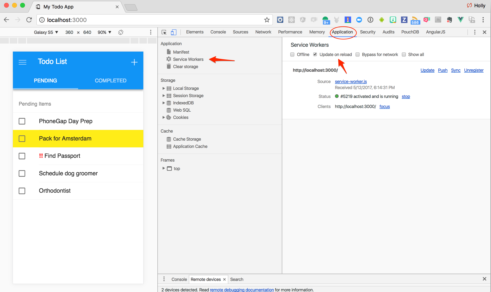

## Overview
Features provided via service workers are considered a progressive enhancement and run only when supported by a browser. For example, with service workers you can cache the app shell and data for your app, so that it's available even when the network isn't. When service workers aren't supported, the offline code isn't called, and the user gets a basic experience. Using feature detection to provide progressive enhancement has little overhead and it won't break in older browsers that don't support that feature.

## Use Cases
- One use case is to check your caches for any fetch request, only attempting to retrieve it from the network if it's not there.

- Another option is to go to the network first, only checking the cache if that fails (e.g. if the device is offline).

## Exercise 

1. From the `www` folder of your project, create a new file and name it **service-worker.js**.

2. In that new file, enter the following code snippet:

        // use a cacheName for cache versioning
    var cacheName = 'v1:todos-pwa-app';

    // during the install phase you usually want to cache static assets
    self.addEventListener('install', function(e) {
        console.log('[ServiceWorker] Install');
        e.waitUntil(
            caches.open(cacheName).then(function(cache) {
                return cache.addAll([
                    '/',
                    'index.html',
                    'service-worker.js',
                    'manifest.json',                
                    'css/app.css',
                    'css/app.ios.css',
                    'css/app.material.css',
                    'js/app.js',
                    'js/todos.js',
                    'js/init-styles.js',
                    /*'cordova.js',
                    'cordova_plugins.js',
                    'plugins/cordova-plugin-statusbar/www/statusbar.js',
                    'plugins/cordova-plugin-statusbar/src/browser/StatusBarProxy.js',
                    'plugins/es6-promise-plugin/www/promise.js',
                    'plugins/phonegap-plugin-service-worker/www/service_worker_container.js',
                    'plugins/phonegap-plugin-service-worker/www/service_worker_registration.js',
                    'plugins/phonegap-plugin-service-worker/www/service_worker.js',
                    'plugins/phonegap-plugin-service-worker/www/kamino.js',*/
                    'lib/framework7/css/framework7.ios.colors.min.css',
                    'lib/framework7/css/framework7.ios.min.css',
                    'lib/framework7/css/framework7.ios.rtl.min.css',
                    'lib/framework7/css/framework7.material.colors.min.css',
                    'lib/framework7/css/framework7.material.min.css',
                    'lib/framework7/css/framework7.material.rtl.min.css',
                    'lib/framework7/js/framework7.min.js',
                    'lib/framework7-icons/framework7-icons.css',
                    'lib/framework7-icons/Framework7Icons-Regular.eot',
                    'lib/framework7-icons/Framework7Icons-Regular.ttf',
                    'lib/framework7-icons/Framework7Icons-Regular.woff',
                    'lib/framework7-icons/Framework7Icons-Regular.woff2',
                    'lib/framework7-vue/framework7-vue.min.js',
                    'lib/vue/vue.min.js', 
                    'img/Default-Portrait.png',
                    'img/Default-Portrait-736@3x.png',
                    'img/icons/apple-touch-icon.png',
                    'img/icons/mstile-150x150.png',
                    'img/icons/safari-pinned-tab.svg',
                    'img/icons/favicon-16x16.png',
                    'img/icons/favicon-32x32.png',
                    'img/icons/favicon.ico',
                    'img/icons/icon-128x128.png',
                    'img/icons/icon-144x144.png',
                    'img/icons/icon-152x152.png',
                    'img/icons/icon-192x192.png', 
                    'img/icons/icon-256x256.png',                       
                ]).then(function() {
                    self.skipWaiting();
                });
            })
        );
    });

    self.addEventListener('activate', function(e) {
    console.log('[ServiceWorker] Activate');
    });

    // Called when the browser fetches a url
    self.addEventListener('fetch', function(event) {
        // either respond with the cached object or go ahead and fetch the actual url
        event.respondWith(
            caches.match(event.request).then(function(response) {
                if (response) {
                    // retrieved from cache
                    console.log("[Service Worker] Retrieved object FROM CACHE for request URL -> " + event.request.url);
                    return response;
                }
                // fetch as normal
                console.log("[Service Worker] Request URL NOT found in cache, fetching... -> " + event.request.url);
                return fetch(event.request);
            })
        );
    });

3. Next we need to register the new service worker so the app is aware of it. Before we register it though, we need to detect if it's supported in the browser environment where the app isncurrent running by checking the existence in the global [`navigator`](https://developer.mozilla.org/en-US/docs/Web/API/Navigator) object. Open your **index.html** file and add the following into the `<head></head>` of the page:

        

  >This is considered a _progressive enhancement_, where it will only enhance the app with the service worker features where supported but run just fine elsewhere.

4. Now run the application again using `phonegap serve`. However, since service workers are required to be run on a secure site (`https://`), OR during dev't with `localhost`, we need to open the browser and specify `localhost` instead of the IP Address returned from the `serve`. Note that you still need to include the port in the URL. The default is 3000 unless you've specified otherwise, so you would navigate to `localhost:3000` as shown below. 

    

4. Use the `Application` tab again to interact with the running service worker. You can simulate an offline event and see how it will still run when you go offline due to the cached resources (also note the console statements about where it's retrieving the resources), but if you navigate to another site like CNN, you will get the dreaded dinosaur:

  
  

  Force an update of the service worker on reload, unregister it and more through this tab:

  

5. You can also view the **Cache Storage** items that the service worker has stored in the **Application** tab as shown in the screenshot below:

  

 >You will sometimes need to refresh to see the latest cache, right click on **Cache Storage** to do so. 

### Network Interception
To illustrate how we can manipulate our service worker to intercept calls and return a completely different response, go through the following steps.

1. Open the **www/service-worker.js** file and modify/replace the `fetch` handler code with the following snippet:

    // Called when the browser fetches a url
    self.addEventListener('fetch', function(event) {  
        // Network interception example      
        if (/\.png$/.test(event.request.url)) {
             event.respondWith(
                 fetch('http://addolo.com/wp-content/uploads/2017/01/90-stunning-silly-cat-pictures-image-inspirations-1280x960-wallpapersother-wallpapers-with-captions.jpg', 
                 {mode: 'no-cors'}).then(function(response) {
                     console.log("Response from network intercept " + response);
                     return response;
             })
         )}
        else {
            // either respond with the cached object or go ahead and fetch the actual url
                caches.match(event.request).then(function(response) {
                    if (response) {
                        // retrieved from cache
                        console.log("[Service Worker] Retrieved object FROM CACHE for request URL -> " + event.request.url);
                        return response;
                    }
                    // fetch as normal
                    console.log("[Service Worker] Request URL NOT found in cache, fetching... -> " + event.request.url);
                    return fetch(event.request);
                })
            );
        }
    });

> We are basically checking the request to see if it is an image and if so return a silly cat picture 
2. Open the **www/index.html** file and uncomment the following line in the Pending todos template:

      ``

### Service Worker Caching

You may find your service worker code is not updating. You can force the update with the Chrome dev tools by going to the **Application** tab, selecting service workers on the left and checking the **Update on Reload** box:

## Resources
- [Service Workers Explained](https://github.com/w3c/ServiceWorker/blob/master/explainer.md)
- [sw-precache](https://github.com/GoogleChrome/sw-precache) - popular project to help generate your service worker based on certain settings. Integrates with your build process.

<a href="lesson3.html" class="btn btn-default"><i class="glyphicon glyphicon-chevron-left"></i> Previous</a>
<a href="lesson5.html" class="btn btn-default pull-right">Next <i class="glyphicon
glyphicon-chevron-right"></i></a>

