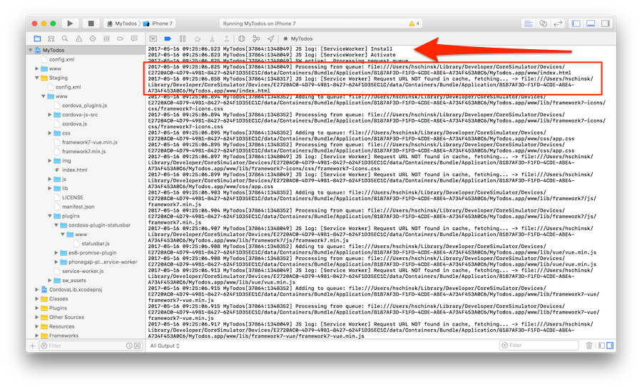
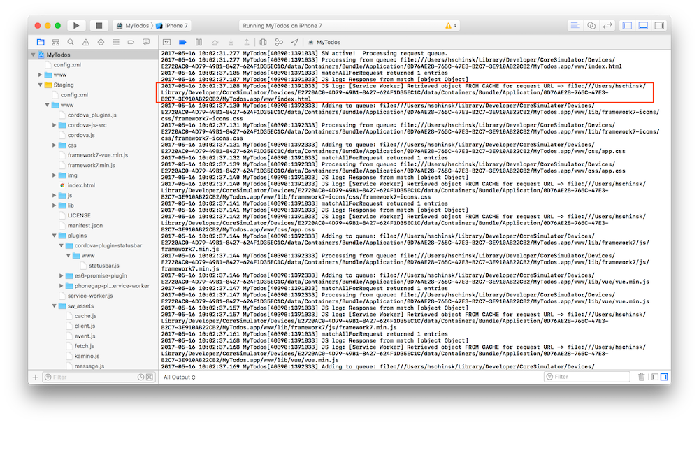
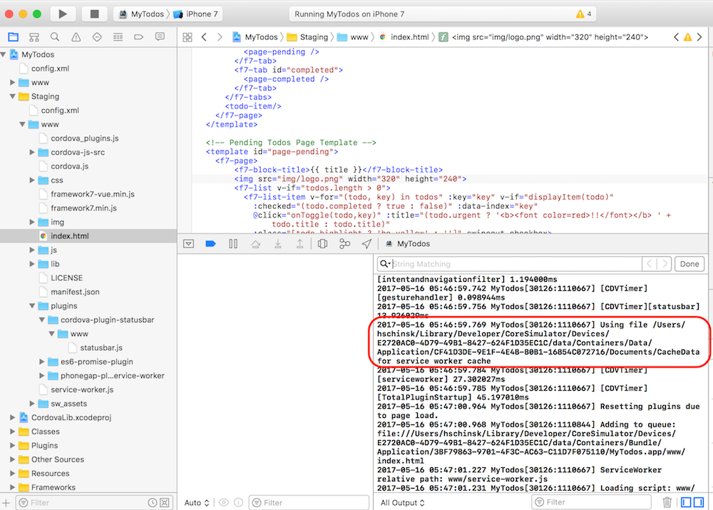
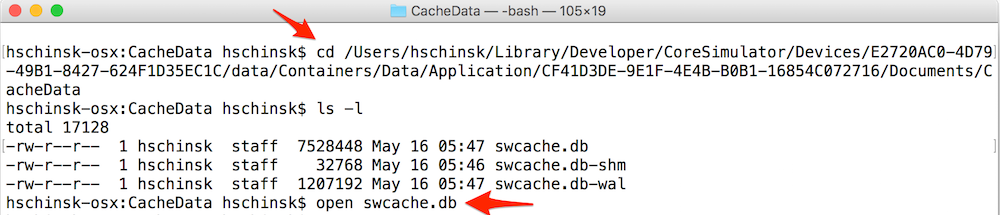
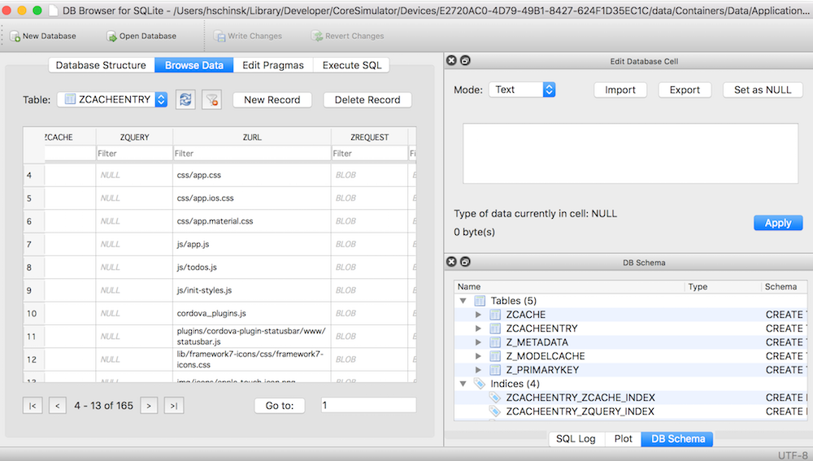
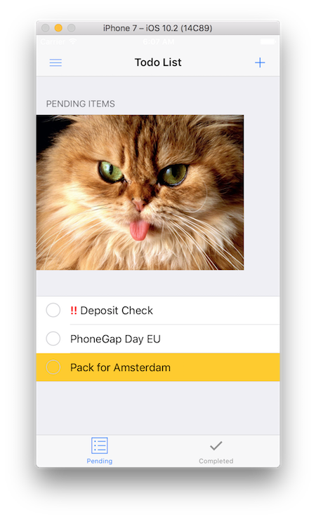

## Overview
It's a well-known fact that Apple currently does not support service workers on iOS. There's nothing much we can do about that when running our apps in the device browser on iOS, however, with Cordova/PhoneGap we have the ability to access native device features via plugins and essentially polyfill the service worker code natively.

There's actually a plugin available now that adds service worker support to your Cordova iOS apps, called [phonegap-plugin-service-worker](https://github.com/phonegap/phonegap-plugin-service-worker).
This plugin was originally built by the [Mobile Chrome Apps team](https://github.com/MobileChromeApps) and subsequently forked by the PhoneGap team with some minor updates. It's undergoing further change but there are some basic features available now, specifically the caching/fetching APIs.

## Exercise

1. Add the [phonegap service worker plugin](https://github.com/phonegap/phonegap-plugin-service-worker) with the following command:

    `phonegap plugin add https://github.com/phonegap/phonegap-plugin-service-worker`

   >If you're using a recent version of the PhoneGap CLI, this plugin will automatically be saved to your config.xml. If you are running an older version you can add the `--save` to the command to ensure that it's saved.

2. Open your **config.xml** and look to ensure you see the plugin tag added like below:

      `<plugin name="phonegap-plugin-service-worker" spec="https://github.com/phonegap/phonegap-plugin-service-worker" />`

3. There are a couple of preferences that are used by the plugin and you will also need to add these into your **config.xml** file.

    - the `ServiceWorker` preference - you need to set this to the filename of the Service Worker JS code to be used when the app is run on iOS

    - the `CacheCordovaAssets` preference - a flag to tell the plugin if you want your Cordova app assets cached when it is first run. The **default is `true`**. Set this to `false` if you do not want your app assets cached.

    Open **config.xml** and add these two preferences with your desired values (or leave off the 2nd if you do want the assets to be cached):

        <preference name="ServiceWorker" value="service-worker.js" />
        <preference name="CacheCordovaAssets" value="false" />

   > The value of the ServiceWorker preference should match the service worker file you created previously in the `www` folder. DO NOT include the `www` in the file path as it is assumed to be located there by the plugin.

4. If you chose to set `CacheCordovaAssets` to `true` above, you will need to add the `CordovaAssets` cache name into your service worker code `goodCaches` array or it will get deleted in our `activate` event. Add the `goodCaches.push('CordovaAssets') as shown below: to the top of the service-worker code from lesson 5. 

            var cacheName = 'todos_offline_cache:v1'
            var goodCaches = [];
            goodCaches.push(cacheName);
            goodCaches.push('CordovaAssets);

4. Now run the CLI `prepare` on the app for iOS to create the Xcode platform (you could alternatively run `build`)

    `phonegap prepare ios`

5. Next open the **my-proj.xcodeproject** file created in the **~/pgday/todos-app-starter/platforms/ios/** folder in Xcode. For instance, if you named your project **todos-app-starter** then it will be named **todos-app-starter.xcodeproject**.

6. Run the app from Xcode and watch the console for the service worker generated statements which indicate if a file was fetched or retrieved from the cache.

  

  Subsequent runs should show the files fetched from the cache.

  

### Debugging on iOS (Simulator)
If you don't see your service worker code updating properly, you can try some of the following:

1. Update the version # in the main Xcode project settings (if you have `CacheCordovaAssets` set to `true` this will force a new cache to be created). 
2. Locate the path of the `~/Library/CoreSimulator/Devices/.../Application/***` app bundle based on the service worker console statements and delete the folder for it. The folder bundle is typically a really long random number like shown in the screenshots.
3. Check to ensure your service worker code (or the **sw_assets**) folder code doesn't have any typos. 

### iOS Cache Data
The `phonegap-service-worker-plugin` writes to a SQLite data store on iOS and also actually logs the location in the Xcode console if you want to take a look at it:

You can download the [DB Browser for SQLite](http://sqlitebrowser.org/) tool to view the data cached by your app. Simply find the location of the cache data in the Xcode console and open the `swcache.db` file:

Then browse the data with the DB Browser:

>The cache name created by the **config.xml** preference when `CacheCordovaAssets` is true is called `CordovaAssets`. If you have another cache you're managing you should see both when you open the database file. 

### Network Intercept Test
Go ahead and try out that same service worker code we tested in lesson 4 for network interception. You'll also need to uncomment the `` tag from `index.html`. 

<a href="lesson5.html" class="btn btn-default"><i class="glyphicon glyphicon-chevron-left"></i> Previous</a>
<a href="lesson7.html" class="btn btn-default pull-right">Next <i class="glyphicon
glyphicon-chevron-right"></i></a>

